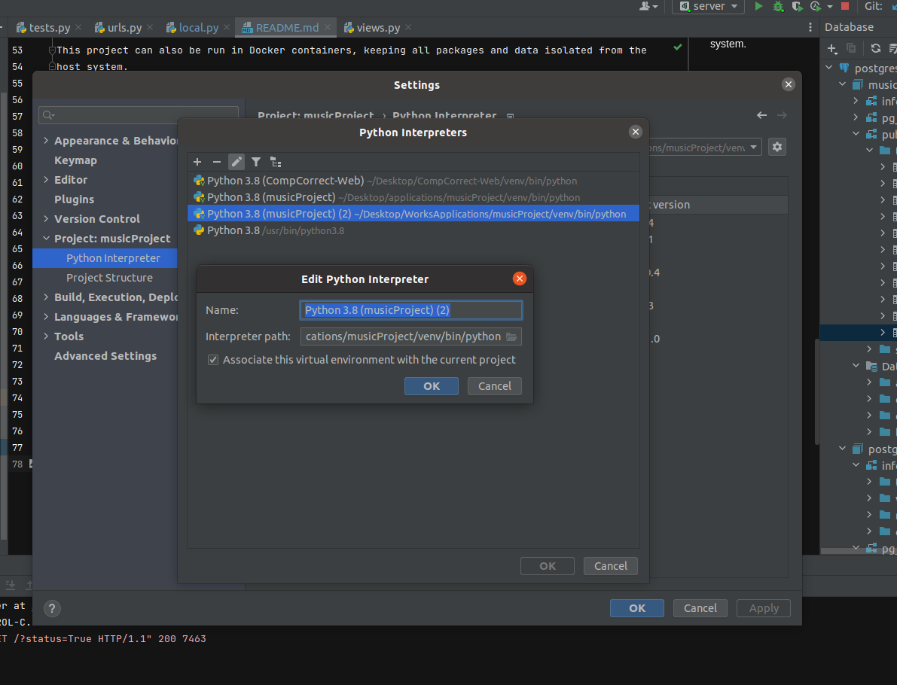
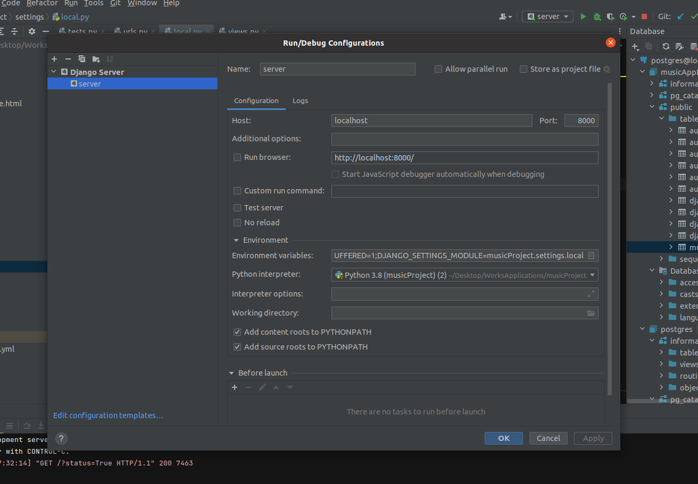

Project Setup

-Database
Install postgres if necessary on the target server.

// linux
$ sudo apt install postgresql postgresql-contrib

Installing postgres on linux creates user and group postgres.
Switch to that user

$ sudo su - postgres
$ psql

## Setting up a database and user for USERNAME

    CREATE USER USER_NAME WITH PASSWORD '******';
    ALTER USER USER_NAME CREATEDB;
    CREATE DATABASE musicDatabase;
    GRANT ALL PRIVILEGES ON DATABASE musicDatabase to USER_NAME;
    ALTER DATABASE musicDatabase OWNER TO USER_NAME; 
    \q

-Server
1- Create a Python3 virtual environment

lines starting with $ for POSIX

lines starting with C:> are the windows variant

    $ cd musicProject
    $ python3 -m venv venv
    C:> python -m venv ./venv
    $ . venv/bin/activate
    C:> .\venv\Scripts\activate

    $ pip install --upgrade pip
    C:> python -m pip install --upgrade pip
    $ pip install -r requirements.txt
    C:> pip install -r requirements.txt

    $ export DJANGO_SETTINGS_MODULE=musicProject.settings.local

(or pass --settings=musicProject.settings.local to commands)

    C:> set DJANGO_SETTINGS_MODULE=musicProject.settings.local

    $ . localDev.sh


## Setting up a Docker container

This project can also be run in Docker containers, keeping all packages and data isolated from the
host system.


### Initial setup

1. Install Docker and Docker Compose
1. Start just the `postgres` container in order to create the `musicDatabase` database in the
   `musicDatabase_postgres` Docker volume.
   ```
    docker-compose up --no-start
    docker-compose start postgres
    docker-compose exec postgres psql -U postgres -c 'CREATE DATABASE musicDatabase;'
   ```
1. Run the initial database migration. The `musical` container has Python as its entrypoint
   executable, so to run a `manage.py` command in it, you can just pass `manage.py ...` as the run
   command.
   ```
   docker-compose run musical manage.py migrate
   ```
1. Start the services
   ```
    docker-compose up -d

Run/Debug configuration

